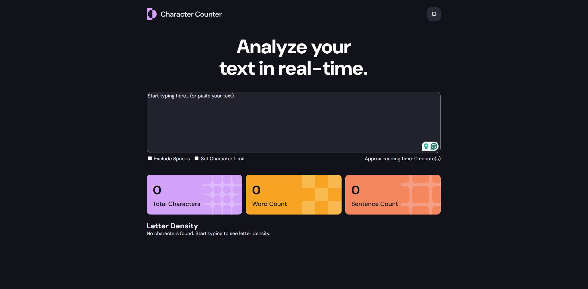

# Character Counter App

A text analysis tool that provides real-time statistics about text input, including word count, character count, sentence count, and letter density. It also supports a dark/light theme toggle and allows users to exclude spaces from character counts.



## Live Site

You can view the live site here: [Character Counter App](https://jayco01.github.io/character-counter-app/)

---

## Features
- **Real-Time Text Analysis**: Updates text statistics instantly as the user types.
- **Word Count, Character Count, and Sentence Count**: Provides essential text metrics to the user.
- **Letter Density Analysis**: Displays the frequency of each letter within the text input.
- **Exclude Spaces Feature**: Allows users to toggle between counting all characters or excluding spaces.
- **Theme Toggle**: Supports dark/light mode switching to enhance user experience.
- **Warning Message Feature**: Notifies users when they exceed a defined character limit.

---

## Built With
- **HTML**, **CSS**, **JavaScript** (Vanilla)

---

### Highlights

1. **Fixing the Shifting of Density Bar:** Adding `barContainer.style.width = "100%";` fixed the issue of the bar slightly shifting left and right during typing.
```javascript
barContainer.style.width = "100%";  // Ensures the bar doesn't shift
```

2. **Theme Toggle Implementation:** I used class toggling and dynamically changing attributes to switch between dark and light themes.
```javascript
function changeTheme() {
  body.classList.toggle("light-mode");
  toggleIcon.src = body.classList.contains("light-mode") ? "./assets/images/icon-moon.svg" : "./assets/images/icon-sun.svg";
}
toggleButton.addEventListener("click", changeTheme);
```

3. **Character, Word, and Sentence Counting:** Setting up functions for counting characters, words, and sentences independently made the logic modular and expandable.

4. **Character Limit Feature:** Implemented warnings by dynamically showing/hiding elements based on text length.
```javascript
if (charLimitCheckbox.checked && text.length > charLimit) {
  warningWrapper.classList.remove("hidden");
} else {
  warningWrapper.classList.add("hidden");
}
```


### Using AI to Tackle Letter Density Algorithm
Creating the **Letter Density Analysis feature** was far more challenging than I expected. Making sure the app updates the density analysis in real-time while keeping the layout stable and visually appealing was tricky. I turned to AI (ChatGPT) to break down the logic, and sort then display data dynamically without affecting performance.

### Algorithm for Letter Density Analysis
Here's the process I used to calculate letter density:
1. **Text Collection:** Grab the text from the `<textarea>` and convert it to lowercase.
2. **Filter Characters:** Only keep alphabetic characters (`a-z`) and ignore everything else.
3. **Count Frequency:** Loop through the text and create an object where keys are letters and values are their counts.
4. **Sort the Data:** Convert the object into an array of key-value pairs and sort them by frequency.
5. **Render Bars:** Generate density bars based on frequency and render them to the DOM.

#### Letter Density Algorithm Code
```javascript
function calculateLetterDensity(text) {
  const letterCount = {};
  for (let char of text.toLowerCase()) {
    if (char.match(/[a-z]/)) {
      letterCount[char] = (letterCount[char] || 0) + 1;
    }
  }
  return Object.entries(letterCount).sort((a, b) => b[1] - a[1]);
}
```

The process of **dynamically updating the DOM** and **sorting the data in real-time** required a deeper understanding of JavaScript’s event loop and rendering process.

---

## Continued Development
Moving forward, I plan to further optimize my JavaScript code by improving performance and enhancing user interaction. I am also considering adding more analytical features and improving the responsiveness of the interface across various devices.

---

## Acknowledgements
I built this project following a Figma file given by frontendmentor.io as a reference. It is part of my portfolio to showcase my growth and skills as a front-end developer.

